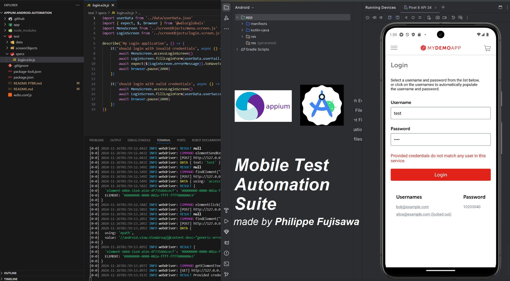

# Automação Android com Appium


## 📜 Descrição do Projeto

Este repositório contém um framework de automação de testes criado utilizando **Appium** para aplicativos Android. O projeto demonstra proficiência em automação de testes mobile, abordando funcionalidades essenciais como configuração de ambientes de teste, criação de scripts reutilizáveis e integração com pipelines CI/CD.

O objetivo é melhorar a confiabilidade e a eficiência dos processos de QA para aplicativos Android, apresentando técnicas avançadas de automação e melhores práticas em testes de software.

---

## 📂 Funcionalidades

- 📱 **Testes Automatizados para Android**: Testes de ponta a ponta para aplicativos Android utilizando Appium.
- 🔧 **Framework Reutilizável**: Estrutura modular e de fácil manutenção para simplificar a gestão dos scripts de teste.
- 🤖 **Integração com CI/CD**: Suporte para testes automatizados em pipelines CI/CD para garantir qualidade contínua.
- 📊 **Relatórios**: Geração de logs e relatórios detalhados para os casos de teste executados.
- 🧩 **Compatibilidade Multi-Dispositivo**: Testes em diversos dispositivos Android e emuladores.

---

## 🚀 Começando

### Pré-requisitos

Certifique-se de ter as seguintes ferramentas instaladas:

- **Node.js** (v14 ou superior)
- **Appium** (última versão)
- **Java Development Kit (JDK)** (v8 ou superior)
- **Android Studio** (com Android SDK configurado)
- **Python** (opcional para scripts adicionais)
- **Dispositivo ou Emulador** configurado para testes

---

### Instalação

1. Clone o repositório:
```bash
git clone https://github.com/philfujisawa/appium-android-automation.git
cd appium-android-automation
```

2. Instale as dependências:
```bash
npm install
```

3. Inicie o servidor Appium:
```bash
appium
```

4. Conecte seu dispositivo Android ou inicie um emulador.

5. Execute os testes:
```bash
npx wdio
```

## 🧪 Como Funciona
**1. Configuração**: O framework inicializa o servidor Appium e conecta ao dispositivo/emulador Android.
**2. Execução de Testes**: Executa scripts de teste automatizados definidos no diretório tests/.
**3. Relatórios**: Gera logs e relatórios dos testes executados para análise dos resultados.

## 🏗️  Tecnologias Utilizadas
+ **Appium**: Framework de automação para aplicativos móveis.
+ **JavaScript**: Scripts de teste e personalização do framework.
+ **Node.js**: Gerenciamento de dependências e integração no lado do servidor.

## 📈 Melhorias Futuras
+ Melhorar o suporte para aplicativos iOS.
+ Adicionar testes de validação visual.
+ Integrar com ferramentas populares de gerenciamento de testes.
+ Expandir a cobertura de testes para casos extremos.

Autor: [Phil Fujisawa](https://github.com/philfujisawa)
Sinta-se à vontade para se conectar comigo via [LinkedIn!](https://www.linkedin.com/in/philippefujisawa/)